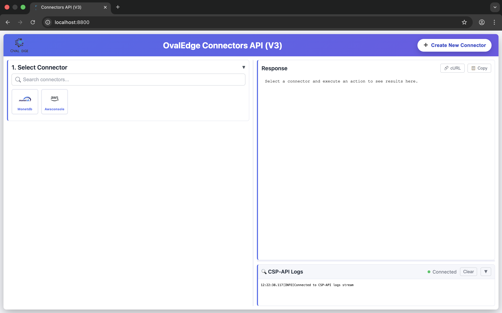

# Getting Started with the OvalEdge Connectors SDK for Java

**What is a Connector?**

Connectors serve as interfaces that integrate external data sources with the application. Metadata is fetched, cataloged, and displayed from source systems such as databases, reporting systems, ETL tools, and file systems. These connections use supported protocols such as REST APIs, JDBC, SDKs, and others.  
![][image1]

[Introduction to Connectors](https://docs.ovaledge.com/connectors/introduction-to-connectors)

You can connect to data sources using [existing connectors](https://docs.ovaledge.com/connectors/connector-repositories). If you don't find a connector that suits your requirements, use the Connector SDK to build your own.

**How will the SDK help in building new connectors?**

The OvalEdge Connectors Software Development Kit(SDK) will help build the new connectors that are not supported. Build and run **OvalEdge connectors** — modular Java components that connect OvalEdge to external data sources (Databases, APIs, ERPs, CRMs, etc.). This repository contains the SDK template with a unified API to test connectors, reference connector source code (e.g., MonetDB, AWS Console), and tooling to scaffold new connectors.

You can either build a connector for your internal use (PRIVATE) or make it available to others (PUBLIC).

* Public connectors can be used by all the OvalEdge customers regardless of who built them.  
* Private Connectors can be built by Partners and Customers, and they can be deployed internally. 

**Who can build the OvalEdge Connector?**  
To build an OvalEdge connector, you should have strong knowledge of Java/J2EE technologies and a solid understanding of data source functionality and technical integration methods, such as APIs, JDBC, SDKs, and similar interfaces. In addition, you should have the data source environment to build and test the connector.

# Table of contents

[1\. Prerequisites](#1.-prerequisites)  
[2\.](#3.-set-up-your-ide) [OvalEdge Connectors Public Repository](#2.-ovaledge-connectors-public-repository)  
3\. [Set up your IDE](#3.-set-up-your-ide)  
4[. Repository structure](#4.-repository-structure)  
5[. What you will build](#5.-what-you-will-develop)  
6\. [Generate the new Connector Source](#6.-generate-the-new-connector-source)  
[7\.](#heading=h.brdkgesbeq6a) [Compile and Build](#7.-compile-and-build)  
[8\. Run and test](#8.-run-and-test)  
9\. [Assemble the new connector](#9.-assemble-the-new-connector)  
[10\. Publishing the assembly JAR](#10.-publishing-the-assembly-jar)  
[11\. Troubleshooting](#11.-troubleshooting)  
[12\. Deployment checklist (partner runtime)](#12.-deployment-checklist-\(partner-runtime\))  
13\. [Summary](#13.-summary)

### 

# 1\. Prerequisites {#1.-prerequisites}

| Requirement | Version/ Notes |
| ----- | ----- |
| OvalEdge SDK Developer Registration | Follow the steps below to register as an OvalEdge SDK Developer  |
| OvalEdge Jfrog Account | Jfrog credentials will be issued after registering as an OvalEdge SDK Developer |
| Java | JDK 21 Ensure JAVA\_HOME points to JDK 21 |
| Maven | 3.8+ Ensure mvn \-v works |
| IDE | IntelliJ IDEA, Eclipse, or VS Code (with Java \+ Maven support). Optional but recommended. |
| git | Install Git command-line utilities and knowledge of git functions to checkout, pull request creation, and merging. |
| Github Account | Ensure you have a GitHub Account https://github.com/ |
| Technical Skills | Strong knowledge of **Java / J2EE** Experience with: REST APIs JDBC / database integrations Authentication mechanisms (OAuth, API Keys, etc.) Understanding of: Data source semantics (BI tools, DBs, SaaS apps) Metadata extraction concepts |

## OvalEdge SDK Developer Registration

Developers must register by sending the following details to:

**📧 developer@ovaledge.com**

* **Organization Name / Individual Name**  
* **Developer Type**  
  * Partner  
  * Sister Company  
  * Contractor / Service Provider  
* **Primary Contact Details**  
  * Email Address  
  * Phone Number  
* **Intended Connector Use Case**  
* **Target Data Source(s)**  
   *(e.g., Salesforce, SAP, Snowflake, REST APIs, JDBC sources)*

# 

# 2\. OvalEdge Connectors Public Repository {#2.-ovaledge-connectors-public-repository}

The OvalEdge Connectors SDK provides a prebuilt sample repository to develop new connectors. 

[https://github.com/ovaledge/oe\_csp\_sdk](https://github.com/ovaledge/oe_csp_sdk) 

Fork this repository. 

Fork this repository into your own GitHub account

# 

# 3\. Set up your IDE  {#3.-set-up-your-ide}

## 3.1 Code Checkout

* Check out the repository to the local directory using git

## 3.2 Import as a Maven Project

Open the repository root in your IDE and import (or auto-detect) the root pom.xml as a Maven project. This ensures all modules (csp-api, assembly, connectors) are loaded correctly.

## 3.3 Setup Java 21

Set the project SDK and language level to **Java 21**, matching the version defined in the parent POM.

**IntelliJ IDEA**

* *File → Project Structure → Project* → Set **Project SDK** to Java 21  
* *Build, Execution, Deployment → Build Tools → Maven* → Configure Maven to use the same JDK (21)

**Eclipse**

* *Project → Properties → Java Build Path* → Set JRE to Java 21  
* Ensure *Maven → Java configuration* is also set to Java 21

**VS Code**

* Install **Extension Pack for Java** and **Maven for Java**  
* Open the repository folder  
* Configure java.configuration.runtimes to point to JDK 21 if required

## 3.4 Verify Setup

After code checkout, run the following command from the repository root to compile and build the project.

```
mvn clean install -DskipTests
```

If everything is properly set up, it will compile successfully, and the output is as follows.  
![][image2]

### 

# 4\. Repository structure {#4.-repository-structure}

After importing the project to IDE, you will see the following modules and files in the Project Explorer.  
![][image3]

| Module/File | Purpose |
| :---- | :---- |
| assembly | Builds a single shaded JAR with all SDK connectors for deployment; merges connector service files for ServiceLoader discovery. |
| connector-archetype | Maven archetype to generate a new CSP connector module (layout, POM, SPI stubs). |
| csp-api | Spring Boot REST gateway for testing; discovers connectors via ServiceLoader; connection validation, metadata, query execution; routing by serverType. |
| monetdb | Reference MonetDB (JDBC) connector; implements AppsConnector, MetadataService, QueryService; optional QuickApplication for standalone testing. |
| awsconsole | Reference AWS Console connector; implements AppsConnector and related services. |
| .docs | Documentation (SDK guide, connector interface reference). |
| build-csp-sdk.sh | Script to build the assembly (fat) JAR from repo root. |
| pom.xml | Root Maven POM: modules, dependency management, shared build config. |

### 

### 

# 5\. What you will develop {#5.-what-you-will-develop}

A connector is a **Maven module** that:

1. Implements **AppsConnector** (connection validation, metadata, query, server type, connection attributes).  
2. Provides **MetadataService** (supported object types, containers, objects, fields).  
3. Provides **QueryService** (execute query / fetch data for an entity).  
4. Is registered in META-INF/services/com.ovaledge.csp.v3.core.apps.service.AppsConnector so the SDK and csp-api can discover it.

Optionally, it can include a **quick** package: a small Spring Boot app to run and test that connector alone (e.g., health, connection validate, supported-objects). For a clearer understanding, review the monetdb and awsconsole connectors.

## 5.1 Connector contract

For implementation, treat the [Connector Interfaces Reference](?tab=t.d8xv4jr7d3wm) as the source of truth for:

* required vs optional/default methods  
* method inputs/outputs/errors/invariants  
* lifecycle execution order  
* thread-safety and performance expectations

## 5.2 Connector Interfaces

### 5.2.1 AppsConnector (from csp-sdk-core)

Your connector class must implement:

| Method | Purpose |
| ----- | ----- |
| getServerType() | Unique string used in requests (e.g., "monetdb", "myapp"). Use lowercase. |
| validateConnection(ConnectionConfig config) | Validate credentials/settings; return success/failure. |
| getMetadataService() | Return your MetadataService implementation. |
| getQueryService() | Return your QueryService implementation. |
| getAttributes() | Connection form definition (host, port, username, password, etc.) for the OvalEdge UI. |
| exchangeAttributes(ConnInfo) / exchangeAttributes(Map) | Map between UI attributes and ConnInfo / config. |

Additional methods (getExtendedAttributes, exchangeVaultAttributes, getVaultPath, etc.) are used for secrets/vault and governance; you can delegate to BaseAppConnector for common behavior (see monetdb).

### 5.2.2 MetadataService

| Method | Purpose |
| ----- | ----- |
| getSupportedObjects() | List supported entity types (e.g., entities, reports). |
| getContainers(ContainersRequest) | List top-level containers (e.g., schemas, companies, accounts). |
| getObjects(ObjectRequest) | List objects (e.g., tables, entities, reports) in a container for a type. |
| getFields(FieldsRequest) | List fields (columns) for a given object. |

### 5.2.3 QueryService

| Method | Purpose |
| ----- | ----- |
| fetchData(QueryRequest) | Execute the query (filters, fields, limit, offset) and return rows. |

## 5.3 Required vs optional (implementation checklist) 

* **Required to implement:** \`AppsConnector\`, \`MetadataService\`, \`QueryService\` contracts used by runtime routing and query flow.  
* **Optional/default:** EDGI and SDK version methods when the connector does not support those workflows.  
* **Strongly recommended:** annotate the connector with \`**@SdkConnector(artifactId="...")**\` and include a release metadata file for runtime auditability.

# 6\. Generate the new Connector Source {#6.-generate-the-new-connector-source}

We can scaffold a new connector from the command line using the Maven archetype. This will generate all the classes with empty methods for us to implement and develop the new connector.

## Generate with Maven archetype (CLI)

1. **Prerequisite**: Build and install the archetype once from the repo root:

```
mvn clean install -pl connector-archetype -am
```

2. **Generate the connector:** From the forked repository root, run in **non-interactive mode** (recommended) so all parameters are supplied and Maven does not prompt:

```
mvn archetype:generate -DarchetypeGroupId=com.ovaledge -DarchetypeArtifactId=oe-csp-connector-archetype -DgroupId=com.ovaledge -DarchetypeVersion=<version> -DartifactId=<artifactId> -Dversion=<version> -DclassPrefix=<classPrefix> -DsdkVersion=<version> -DinteractiveMode=false
```

3. **Maven Args:**

| Argument | Purpose |
| ----- | ----- |
| \-DarchetypeGroupId=com.ovaledge | Maven groupId of the archetype. This should be **com.ovaledge** by default and is **fixed**; **it should not change.** |
| \-DarchetypeArtifactId=oe-csp-connector-archetype | The Maven artifactId of the archetype. This value is fixed and identifies the connector archetype. It must always be set to **oe-csp-connector-archetype** and **should not be changed**.  |
| \-DarchetypeVersion=\<version\> | Version of the archetype to use; must match the **oe\_csp\_sdk** parent version (e.g. 1.0.0-SNAPSHOT). |
| \-DgroupId=com.ovaledge | Maven groupId for the **generated** connector module (typically com.ovaledge). |
| \-DartifactId=\<artifactId\> | Maven artifactId for the generated module; use a single lowercase word (e.g. amazonq). Becomes the module directory name and the base package segment com.ovaledge.csp.apps.\<artifactId\>. No hyphens. |
| \-Dversion=\<version\> | Version of the generated connector; usually the same as **oe\_csp\_sdk** (e.g. 1.0.0-SNAPSHOT). |
| \-DclassPrefix=\<classPrefix\> | PascalCase prefix for generated Java classes (e.g. AmazonQ). Produces \<classPrefix\>Connector, \<classPrefix\>MetadataService, \<classPrefix\>QueryService, etc. |
| \-DsdkVersion=\<version\> | Version of the CSP SDK (csp-sdk-core) the connector will depend on; use the same as **oe\_csp\_sdk** (e.g. 1.0.0-SNAPSHOT). |
| \-DinteractiveMode=false | Disables Maven prompts; all parameters must be supplied on the command line. Omit (or set to true) to run interactively. |

4. **Replace placeholders:**

   \`\<version\>\` — oe\_csp\_sdk parent version (e.g. 1.0.0-SNAPSHOT\`)

   \`\<artifactId\>\` — connector module name (e.g. \`amazonq\`)

   \`\<classPrefix\>\` — PascalCase prefix for generated classes (e.g. \`AmazonQ\`)

   Example:

```
mvn archetype:generate -DarchetypeGroupId=com.ovaledge -DarchetypeArtifactId=oe-csp-connector-archetype -DgroupId=com.ovaledge -DarchetypeVersion=1.0.0-SNAPSHOT -DartifactId=amazonq -Dversion=1.0.0-SNAPSHOT -DclassPrefix=AmazonQ -DsdkVersion=1.0.0-SNAPSHOT -DinteractiveMode=false
```

   To run interactively (Maven will prompt for any missing properties), omit \`-DinteractiveMode=false\` and the \`-DartifactId\`, \`-DclassPrefix\`, etc. parameters you do not wish to preset.

5. **Conventions**:  
   * **artifactId**: Use a single lowercase word (e.g. amazonq) so the generated Java package com.ovaledge.csp.apps.\<artifactId\> is valid. Do not use hyphens.  
   * **classPrefix**: Use PascalCase (e.g. AmazonQ). Generated classes will be named \<classPrefix\>Connector, \<classPrefix\>MetadataService, etc.  
6. **Next steps:** Follow the generated **INSTRUCTIONS.txt** in the connector module root to add the module to the parent pom, csp-api, and assembly (same steps as in [section 9](#9.-assemble-the-new-connector)).  
7. **Icon:** Place amazonq.png (or similar) under amazonq/src/main/resources/icons/ for the connector icon in the UI.

## Generate from csp-api UI

Use this option when you want the SDK to generate a starter connector module from the UI:
1. Start `csp-api` from the repository root:

```
mvn clean install -pl csp-api -am
java -jar csp-api/target/csp-api-*.jar
```

2. Open the UI at `http://localhost:8800/` and click **Create New Connector**.



In the **Create New Connector** form:
- **Connector Name / Data Source**: Connector name (for example, `MyConnector`)
- **Repository Root (server path)**: Absolute path to your local `oe_csp_sdk` repo root
- **Connector Objects**: Objects your connector supports (tables, views, etc.)
- **Connector Icon**: Icon file shown in the UI
- **Connector Capabilities**:
  - **Protocol**: Select the connector protocol (`REST`, `SOAP`, `SDK`, `JDBC`, or `Other`)
  - **Core Capabilities**: Enable what the connector should expose (for example, Crawling, Query Sheet)
  - **Crawler Options / Crawl Types / Crawler Preference**: Select only what your connector supports
- **Research References**: Optional links/notes for implementation context

Choose how you want the generated connector module delivered:

- **Download**: Generates a zip (named after your connector) and downloads it to your machine.
  1. Extract the zip.
  2. Move the generated connector folder into the `oe_csp_sdk` repository root (or wherever you do connector development).

- **Publish**: Generates the connector module **directly into** the working repository you provided in **Repository Root (server path)** (no zip download).

Next steps depend on how you generated the connector:
- **If you used Download**: Open the generated `INSTRUCTIONS.txt` and follow the listed integration steps (parent `pom.xml`, `csp-api`, and `assembly` updates).
- **If you used Publish**: The generator writes the connector module and applies the wiring/dependency updates automatically (no manual changes required).

This gives you a working scaffold so you can focus on implementing connector logic (connection, metadata, and query behavior).

# 7\. Compile and Build {#7.-compile-and-build}

From the **repository root**:

| Goal | Command | Result |
| ----- | ----- | ----- |
| Build one connector | mvn clean install \-pl amazonq \-am | Builds amazonq and its dependencies. |
| Build everything | mvn clean install | Builds all modules (connectors, csp-api, assembly). |
| Build assembly JAR only | mvn clean install \-pl assembly \-am | Builds all modules (connectors, csp-api, assembly) and produces assembly/target/csp-sdk-\*.jar |

### 

### 

# 8\. Run and test {#8.-run-and-test}

#### Option A – Unified API (all connectors)

1. Build: mvn clean install \-pl csp-api \-am (or mvn clean install).  
2. Run: java \-jar csp-api/target/csp-api-\*.jar (Default port is 8800; see csp-api/src/main/resources/application.properties.)  
3. Open the built-in UI (e.g., http://localhost:8800/) to select a connector, set connection attributes, and call connection validate, metadata, and query.  
4. Call REST endpoints with serverType in the body (e.g., "serverType": "monetdb").   
* \`GET /v1/info\` does **not** require a request body.  
*  Metadata/query/validate endpoints require request body and (for some endpoints) query parameters.

Example:

```
curl -s http://localhost:8888/v1/info
```

#### Option B – Standalone connector (quick app)

For a connector that has a quick package (e.g., monetdb):

```
mvn -pl monetdb spring-boot:run
```

Or run the JAR of that module (main class configured in its pom.xml).

### 

# 9\. Assemble the new connector {#9.-assemble-the-new-connector}

After adding a new connector module (e.g., amazonq), wire it into the build and discovery:

1. **Parent pom.xml** (repo root)  
   * In \<modules\>, add: \<module\>amazonq\</module\>.  
   * In \<dependencyManagement\>\<dependencies\>, add:

```
<dependency>
  <groupId>com.ovaledge</groupId>
  <artifactId>amazonq</artifactId>
  <version>${project.version}</version>
</dependency>
```

2. **csp-api/pom.xml**  
   * In \<dependencies\>, add:

```
<dependency>
  <groupId>com.ovaledge</groupId>
  <artifactId>amazonq</artifactId>
</dependency>
```

3. So the unified API can load and route to your connector.  
4. **assembly/pom.xml**  
   * In \<dependencies\>, add the same \<dependency\> (without version).  
     So the assembly JAR includes your connector.  
5. **SPI file**  
   * Already done in Step 6.4: META-INF/services/com.ovaledge.csp.v3.core.apps.service.AppsConnector with your connector’s FQCN.  
     The assembly uses ServicesResourceTransformer to merge all connector SPI files into one.  
6. **Release properties**  
   * The assembly JAR includes a \`release-csp-sdk.properties\` file (with keys \`csp-sdk.release.version\`, \`csp-sdk.git.commit.full\`, \`csp-sdk.git.branch\`, \`csp-sdk.git.buildtime\`).   
   * Connector JARs no longer include connector-specific release metadata; release/version audit is driven by the assembly-level metadata.   
   * **Partners** building assembly artifacts outside this repo must ensure their build produces an equivalent \`release-csp-sdk.properties\`.

Then run:

```
mvn clean install -pl amazonq -am
mvn clean install -pl csp-api -am
# or
./build-csp-sdk.sh
```

to verify the new connector is discovered (e.g., GET /v1/info shows it) and included in the assembly JAR.

### 

# 10\. Publishing the assembly JAR {#10.-publishing-the-assembly-jar}

The **assembly** module produces a single JAR (csp-sdk-\<version\>.jar) that contains all connectors (and their dependencies, except those excluded in the shade plugin, e.g., Spring Boot and csp-core, which are provided by the OvalEdge runtime). This JAR is intended to be placed in the classpath (or “jar path”) of the OvalEdge/CSP application so it can discover and use all connectors.

* Build: ./build-csp-sdk.sh or mvn clean install \-pl assembly \-am.  
* Output: assembly/target/csp-sdk-\<version\>.jar.

![][image4]

### 

# 11\. Troubleshooting {#11.-troubleshooting}

| Issue | What to check |
| ----- | ----- |
| Connector not in /v1/info | SPI file present under META-INF/services/ with the exact interface name and one fully qualified class name (FQCN) per line. Ensure the connector dependency is added to csp-api (and assembly). Rebuild csp-api and assembly. |
| csp-sdk-core not found | Build and install **oe\_csp\_sdk\_core** first (or publish it to the Maven repository your build uses). Ensure your Maven \`settings.xml\`/POM has access to the repository hosting \`csp-sdk-core\` |
| JDBC connection fails in the connector | Ensure ConnectionConfig includes jdbcUrl and username/password. These must be set in the connector from attributes before calling ConnectionPoolManager. See MonetDB’s ensureConnectionConfig. |
| Assembly build fails | Run mvn clean install from the root first so all connector modules are installed. Then run ./build-csp-sdk.sh or mvn clean install \-pl assembly \-am. |
| Port already in use | Change server.port in csp-api/src/main/resources/application.properties (default is 8800). |

### 

# 12\. Deployment checklist (partner runtime) {#12.-deployment-checklist-(partner-runtime)}

Use this checklist after connector development is complete and before handing off to operations.

1. Build a deployable artifact

Build the assembly JAR, which includes all connectors and their connector-specific dependencies (e.g. JDBC drivers). The runtime supplies shared components (csp-sdk-core, Spring, oe-core) to prevent version clashes and duplicate classes.

Generate the assembly/target/csp-sdk-\<version\>.jar using ./build-csp-sdk.sh or mvn clean install \-pl assembly \-am.

2. Upload/copy JAR for OvalEdge pickup  

  Copy artifact(s) to the runtime-configured jar path used by OvalEdge for connector loading.    
  The exact folder is environment-specific and configured in OvalEdge system settings (**ovaledge.jarpath**).

3. Ensure runtime prerequisites  

  Required shared dependencies must be available in the runtime classpath (for example, \`csp-sdk-core\` and platform-shared bundles used in your environment).    
  Connector JAR should include \`release-{artifactId}.properties\` metadata.

4. Restart services  

  Restart OvalEdge services so new connectors are discovered.

5. Verify deployment  

  Confirm the connector appears in the connectors page in OvalEdge.    
  Run connection validation, metadata calls, and one sample query.    
  Confirm release/version metadata is visible in the connector audit/release history views.

6. Rollback  

  Keep the previously known-good JAR; if validation fails, restore the old JAR and restart services.

### 

# 13\. Summary {#13.-summary}

Before starting new connector development, confirm contract details in the [Connector Interfaces Reference](?tab=t.d8xv4jr7d3wm)

* **Prerequisites**  
  1. JDK 21  
  2. Maven  
  3. **oe\_csp\_sdk\_core** built and installed, or available in your Maven repository (provides csp-sdk-core)  
* **Connector**  
  1. Single module implementing:  
     * AppsConnector  
     * MetadataService  
     * QueryService  
  2. SPI registration included  
  3. Optional **quick** app for standalone connector testing  
* **Build**  
  1. Run mvn clean install, or  
  2. Use ./build-csp-sdk.sh to produce the assembly JAR  
* **Run**  
  1. Use **csp-api** to run a single API and UI serving all connectors, or  
  2. Run a connector’s **quick** app to start only that connector  
* **Adding a New Connector**  
  1. Create a new module  
  2. Implement the required connector contracts  
  3. Add the SPI registration file  
  4. Add the module and dependencies to:  
     * Parent POM  
     * csp-api  
     * Assembly module  
  5. Build and test
  